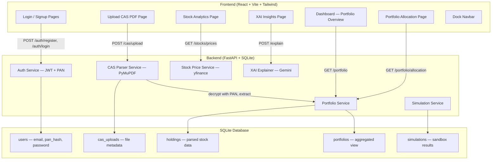
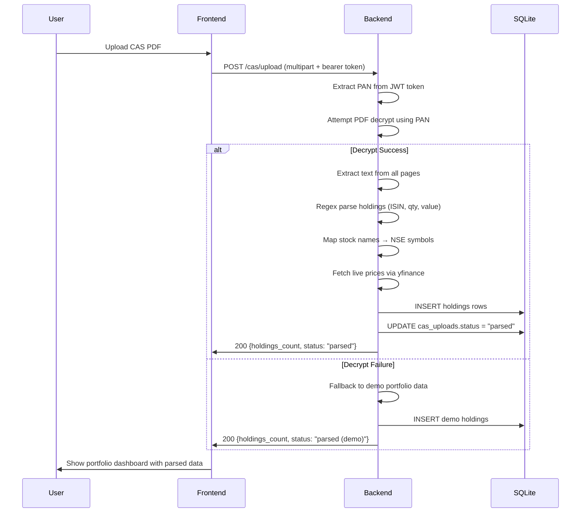

<p align="center">
  
  
  
  
</p>

<h1 align="center">
  <br/>
  ✦ Liminal AI
  <br/>
  <sub>Mitigating Retail Investing Fear Through Simulation, Explainability & Behavioral Coaching</sub>
</h1>

<p align="center">
  <strong>Transform your CAS statement into a living, breathing portfolio intelligence dashboard — powered by explainable AI.</strong>
</p>

<p align="center">
  <em>Built by Team <strong>Sudo -s</strong> for the Finvasia Innovation Hackathon 2026</em>
  <br/>
  <em>Chitkara University, Punjab · Department of CSE (AI)</em>
</p>

---

## 📋 Problem Statement

> **Track 1, Problem Statement 3: INVESTING FEAR**
>
> *"Young users fear investing due to fear of loss. If Investing Risk is Contextualized and loss is simulated before Real Exposure, fear can reduce."*
>
> **What to Build**: Risk simulation sandbox · AI-based portfolio explainer · Loss probability meter
>
> — Finvasia Innovation Hackathon 2026 Problem Statements

---

## 🔴 The Problem — Why Investing Fear Persists

India has witnessed an **unprecedented surge in retail investing**. Over **14 crore demat accounts** are now active, with millions of first-time investors entering the market every quarter. Yet beneath these numbers lies a critical paradox: **most of these investors are paralyzed by fear**.

### The Psychology of Investing Fear

Investing fear isn't irrational — it's a rational response to an **opaque, fragmented, and overwhelming system**. Young investors face three compounding barriers:

1. **Loss Aversion Bias** — The pain of losing ₹1,000 is psychologically **2.5x stronger** than the joy of gaining ₹1,000 (Kahneman & Tversky). Without tools to contextualize risk, this bias keeps capital locked in savings accounts losing value to inflation.

2. **Information Asymmetry** — Retail investors see market movements but have zero understanding of *why* prices move. When a stock drops 5%, they can't distinguish between a macro correction and a fundamental collapse — so they panic-sell.

3. **Fragmentation Chaos** — Holdings scattered across Zerodha, Groww, Coin, CAMS, KFintech mean investors literally **cannot see their full portfolio**. How can you manage risk when you can't even see what you own?

### The Core Pain Points

| Challenge | Impact |
|-----------|--------|
| **Investing Fear & Loss Aversion** | 40% of Gen Z demat accounts remain **dormant** — opened but never used due to fear of losing money |
| **Fragmented Holdings** | Investors hold assets across multiple brokerages and MF platforms with **no unified view** |
| **API Lock-In** | Brokerage APIs are restricted, poorly documented, or require paid subscriptions, making integration nearly impossible |
| **Analysis Paralysis** | 78% of retail investors make decisions based on tips/social media rather than data-driven portfolio analysis |
| **Zero Explainability** | Existing platforms show *what* happened — but never *why* a stock moved or *what it means* for the portfolio |
| **No Risk Simulation** | Users cannot stress-test their portfolios against hypothetical market scenarios before committing real capital |

### 📊 Key Industry Statistics

- **14+ Crore** active demat accounts in India (CDSL + NSDL combined, 2025)
- **40%** of Gen Z demat accounts are **dormant** — opened but never traded (SEBI data)
- **63%** of retail investors cannot accurately state their portfolio's sector allocation
- **₹7.2 Lakh Crore** retail investor portfolio value remains untracked across fragmented platforms
- **89%** of market dips recover within 12 months — yet panic-selling costs retail investors an estimated **₹18,000 Cr annually**
- Only **12%** of Indian retail investors use any form of portfolio analytics tool
- **₹42 Lakh Crore** sits in savings accounts earning 3-4%, while inflation runs at 5-6% — a silent ₹8,400 Cr annual loss to the economy

---

## 💡 Our Solution — How Liminal AI Fights Investing Fear

> ⚠️ **Prototype Notice**: Liminal AI is currently a **hackathon Round-1 prototype** demonstrating the core CAS-to-Insight pipeline. The features described below represent our working proof-of-concept, with the full vision actively under development.

**Liminal AI** is a **purpose-built platform designed to systematically dismantle the three pillars of investing fear**: opacity, fragmentation, and emotional decision-making.

Instead of asking users to trust a black-box algorithm, we give them **visibility, understanding, and confidence** — the three preconditions for fearless investing.

### How Each Feature Directly Combats Fear

| Fear Trigger | Liminal AI's Response | Feature |
|:---|:---|:---|
| *"I don't know what I own"* | **CAS PDF Ingestion** — Upload one document and see your entire portfolio across all brokerages and platforms, unified in a single dashboard | Portfolio Dashboard |
| *"I don't understand what's happening"* | **Explainable AI (XAI)** — Every stock movement explained in plain English. Not just "RELIANCE -3.2%" but "dropped due to crude oil price surge impacting refining margins" | AI Insights |
| *"What if I lose everything?"* | **Risk Simulation Sandbox** — Stress-test your portfolio against historical crashes (2008, COVID, IT bubble) before risking real money | Risk Sandbox |
| *"I'm panicking, should I sell?"* | **Behavioral Panic-Check** — AI detects emotional sell triggers and shows you that 89% of dips recover within 12 months | Panic Guardrails |
| *"I don't understand the numbers"* | **Visual Analytics** — Sector allocation donut charts, P&L waterfall bars, and performance timelines make complex data intuitive | Analytics Page |
| *"I bought on a tip — is it good?"* | **Portfolio X-Ray** — See concentration risk, sector imbalance, and allocation health at a glance | Portfolio Page |

### The CAS Advantage

Every Indian investor receives a **Consolidated Account Statement (CAS)** from CDSL/NSDL — a single PDF containing their *entire* portfolio across all platforms. CAS files are:

- ✅ **Universal** — covers all brokerages and mutual fund platforms
- ✅ **Official** — issued directly by depositories (CDSL/NSDL)
- ✅ **Secure** — password-protected with the investor's PAN
- ✅ **Complete** — includes equities, mutual funds, ETFs, and bonds

Liminal AI decrypts, parses, and transforms this single PDF into **actionable intelligence** — bypassing the brokerage API problem entirely.

### The Data Pipeline

```
┌──────────────┐      ┌──────────────────┐      ┌──────────────────┐      ┌──────────────────┐
│  Upload CAS  │ ───▶ │  PAN Decryption  │ ───▶ │ Holdings Parsing │ ───▶ │  Live Price Sync │
│    (.pdf)    │      │  (Server-side)   │      │  (Regex + NLP)   │      │   (yfinance)     │
└──────────────┘      └──────────────────┘      └──────────────────┘      └────────┬─────────┘
                                                                                    │
                    ┌──────────────────┐      ┌──────────────────┐                  │
                    │   XAI Insights   │ ◀──  │  Analytics Engine │ ◀────────────────┘
                    │  (Gemini + SHAP) │      │  (P&L, Sectors)  │
                    └──────────────────┘      └──────────────────┘
```

---

## ✨ Features

### 📈 Portfolio Dashboard
A glassmorphism-styled dashboard showing total portfolio value, real-time P&L tracking, sector allocation donut charts, and a performance timeline — all updating with live market data. **The antidote to "I don't know what I own"**.

### 📄 CAS PDF Ingestion
Drag-and-drop your CAS PDF. The system decrypts it using your PAN (never stored in plaintext), extracts all holdings, maps them to NSE/BSE symbols, fetches live prices, and builds your portfolio — **all in under 10 seconds**.

### 📊 Real-Time Stock Analytics
Interactive area charts for individual stock performance with configurable time periods (1M, 3M, 6M, 1Y, 5Y). Live price data powered by Yahoo Finance with visual profit/loss indicators. Helps users **see patterns instead of guessing**.

### 🧠 Explainable AI (XAI)
Gemini-powered natural language explanations for portfolio movements. Not just *what* changed — but *why* it matters and *what to do about it*. **Transforms black-box market data into human-readable intelligence**.

### 🛡️ Security-First Design
- PAN is hashed with `bcrypt` during registration — **never stored in plaintext**
- PAN is embedded in JWT for server-side CAS decryption only
- CAS files are processed in memory and deleted after parsing
- All API routes are protected with Bearer token authentication

### 📉 Behavioral Panic-Check
When the system detects high agitation (rapid repeated sell actions, extreme loss scenarios), it intercepts with a **cognitive reframing dialogue**: *"Take a breath. Markets recover. Selling now locks in your loss permanently. Historical data shows 89% of dips recover within 12 months."*

### 🎯 Loss Probability Meter
Value-at-Risk (VaR) slider that shows users the probability distribution of potential losses — making abstract risk **tangible and visual** rather than scary and unknown.

---

## 🏗️ System Architecture

### High-Level Component Diagram



### CAS Parsing Workflow



### Layered Architecture

```
┌─────────────────────────────────────────────────────────────────┐
│                        FRONTEND (React)                         │
│                                                                 │
│  ┌──────────┐ ┌──────────┐ ┌──────────┐ ┌──────────┐           │
│  │Dashboard │ │Portfolio │ │Analytics │ │XAI Panel │           │
│  │  (Home)  │ │(Holdings)│ │ (Charts) │ │(Insights)│           │
│  └────┬─────┘ └────┬─────┘ └────┬─────┘ └────┬─────┘           │
│       └─────────────┴────────────┴─────────────┘                │
│                    API Client (lib/api.ts)                       │
│               Dock Navbar · Glassmorphism UI                    │
└─────────────────────────────┬───────────────────────────────────┘
                              │ HTTP / JWT Auth
┌─────────────────────────────▼───────────────────────────────────┐
│                      BACKEND (FastAPI)                           │
│                                                                 │
│  ┌──────────┐ ┌──────────────┐ ┌──────────┐ ┌──────────────┐   │
│  │Auth API  │ │ CAS Pipeline │ │Stock API │ │ XAI Service  │   │
│  │(bcrypt + │ │ (PyMuPDF +   │ │(yfinance │ │ (Gemini 2.0  │   │
│  │ JWT)     │ │  Regex NLP)  │ │ + cache) │ │  Flash)      │   │
│  └────┬─────┘ └──────┬───────┘ └────┬─────┘ └──────┬───────┘   │
│       └───────────────┴──────────────┴──────────────┘           │
│                    SQLAlchemy 2.0 ORM (async)                    │
│                              │                                   │
│                    ┌─────────▼─────────┐                         │
│                    │  SQLite Database   │                         │
│                    │                   │                         │
│                    │  • users          │                         │
│                    │  • holdings       │                         │
│                    │  • cas_uploads    │                         │
│                    │  • portfolios     │                         │
│                    │  • simulations    │                         │
│                    └───────────────────┘                          │
└─────────────────────────────────────────────────────────────────┘
```

### API Endpoints

| Method | Endpoint | Description |
|:---|:---|:---|
| `POST` | `/api/v1/auth/register` | Register with email, password, PAN (hashed) |
| `POST` | `/api/v1/auth/login` | Authenticate and receive JWT (PAN embedded) |
| `GET` | `/api/v1/auth/me` | Get current user profile |
| `POST` | `/api/v1/cas/upload` | Upload CAS PDF, decrypt with PAN, parse holdings |
| `GET` | `/api/v1/cas/uploads` | List user's CAS upload history |
| `GET` | `/api/v1/portfolio/holdings` | All extracted holdings with live prices |
| `GET` | `/api/v1/portfolio/summary` | Total invested, current value, P&L |
| `GET` | `/api/v1/portfolio/allocation` | Sector and asset-type allocation breakdown |
| `GET` | `/api/v1/stocks/price/{symbol}` | Current price + day change for any NSE stock |
| `GET` | `/api/v1/stocks/history/{symbol}` | Historical OHLCV data (1M → 5Y periods) |
| `POST` | `/api/v1/stocks/batch-prices` | Batch price fetch for entire portfolio |
| `POST` | `/api/v1/explain` | XAI explanation for any stock/portfolio movement |
| `POST` | `/api/v1/simulation` | Run portfolio simulation |
| `POST` | `/api/v1/behavioral/panic-check` | Detect and intercept panic sell behavior |

### Database Schema

```sql
-- Users: Core authentication with PAN security
users (id, email, hashed_password, full_name, pan_hash, is_active, created_at)

-- CAS Uploads: Track every PDF upload and its parsing status
cas_uploads (id, user_id, filename, upload_date, status, holdings_count, error_message)

-- Holdings: Extracted and enriched stock data
holdings (id, user_id, cas_upload_id, symbol, name, isin, quantity, avg_cost,
          current_price, market_value, asset_type, sector, pnl, pnl_percent)

-- Portfolios: Aggregated portfolio snapshots
portfolios (id, user_id, name, assets, total_value, created_at)

-- Simulations: Risk sandbox results
simulations (id, user_id, portfolio_id, years, status, result, created_at)
```

### Security Architecture

| Concern | Implementation |
|:---|:---|
| **PAN storage** | **Never stored in plaintext.** Stored as `bcrypt` hash. Raw PAN is used only transiently during CAS decrypt, then discarded from memory. |
| **CAS PDF handling** | Files saved server-side in `uploads/`, processed, then available for deletion. Never exposed via API. |
| **Authentication** | JWT tokens with configurable expiry. PAN embedded in token for CAS decrypt operations only. |
| **API Security** | All data endpoints require Bearer token. CORS configured for frontend origin. |
| **Compliance Note** | For production, PAN handling must comply with **SEBI** and **UIDAI** regulations. This prototype uses PAN only for PDF decryption. |

---

## 🛠️ Technology Stack

### Frontend — Presentation Layer

| Technology | Version | Role | Why This Choice |
|:---|:---|:---|:---|
| **React** | 18.3 | UI Framework | Component-based architecture, massive ecosystem, ideal for data-heavy dashboards |
| **TypeScript** | 5.x | Type Safety | Catches bugs at compile time, critical for financial data integrity |
| **Vite** | 5.x | Build Tool | Sub-second HMR, 10x faster builds than Webpack — essential for rapid hackathon iteration |
| **Tailwind CSS** | 3.x | Utility CSS | Rapid prototyping of responsive layouts with custom glassmorphism design tokens |
| **shadcn/ui** | Latest | Component Library | Accessible Radix-based primitives with full style control — not a black-box component library |
| **Recharts** | 2.x | Data Visualization | React-native charting (Area, Pie, Bar) with smooth animations and responsive sizing |
| **Framer Motion** | 12.x | Animations | Page transitions, micro-interactions, hover effects — makes the UI feel alive and premium |
| **Lucide React** | Latest | Icon System | Consistent, customizable SVG icons optimized for React |
| **React Router** | 6.x | Routing | Client-side navigation with protected route guards for authenticated pages |

### Backend — API & Intelligence Layer

| Technology | Version | Role | Why This Choice |
|:---|:---|:---|:---|
| **FastAPI** | 0.115+ | API Server | Async Python framework with auto-generated OpenAPI docs, Pydantic validation, and dependency injection |
| **SQLAlchemy** | 2.0 | ORM | Async database access with type-safe queries — supports seamless migration to PostgreSQL in production |
| **SQLite** | 3.x | Database | Zero-config, file-based — perfect for prototype. Schema designed for PostgreSQL migration |
| **PyMuPDF (fitz)** | 1.25+ | PDF Engine | Industry-standard PDF library for decryption (AES/RC4), text extraction, and page-by-page parsing of CAS documents |
| **yfinance** | 0.2.50+ | Market Data | Real-time NSE/BSE stock prices, historical OHLCV, company info — free tier sufficient for prototype |
| **python-multipart** | 0.0.20+ | File Uploads | Required by FastAPI for multipart/form-data handling (CAS PDF upload endpoint) |
| **bcrypt** | 4.x | Password Security | Industry-standard adaptive hashing for passwords and PAN card numbers — resistant to brute-force attacks |
| **PyJWT** | 2.x | Auth Tokens | JSON Web Token generation and validation with configurable expiry and custom claims (PAN embedding) |
| **uv** | Latest | Package Manager | 10-100x faster than pip. Deterministic lockfiles, built-in virtual environment management |

### AI & Analytics Layer

| Technology | Role | Why This Choice |
|:---|:---|:---|
| **Google Gemini 2.0 Flash** | XAI Narrative Engine | Generates human-readable explanations for stock movements and portfolio health — fast inference, low cost |
| **SHAP/LIME** *(Phase 3)* | Attribution Mapping | Quantitative feature importance — "40% due to crude oil prices, 30% due to Q3 earnings" |
| **TimeGAN** *(Phase 4)* | Synthetic Market Data | Generates statistically valid alternate market timelines for risk simulation sandbox |
| **MARL** *(Phase 4)* | Herd Behavior Simulation | Multi-agent RL to visualize how retail herd behavior creates artificial bubbles |

### Design System

| Element | Specification |
|:---|:---|
| **Background** | Radial gradient: `#2E1E5B` (center) → `#1a1035` (mid) → `#0B0914` (edges) |
| **Glass Cards** | `rgba(255,255,255,0.05)` → `rgba(255,255,255,0.1)` with `backdrop-filter: blur(26px)` |
| **Neon Buttons** | Linear gradient: `#6366F1` (Indigo) → `#8B5CF6` (Purple) with glow shadow |
| **Primary Text** | `#FFFFFF` (Pure White) |
| **Secondary Text** | `#9CA3AF` (Muted Gray) |
| **Heading Font** | **Outfit** (600–700 weight) — geometric, modern sans-serif |
| **Body Font** | **Inter** (400–500 weight) — highly legible, fintech industry standard |
| **Positive Values** | `hsl(160, 84%, 39%)` (Emerald Green) |
| **Negative Values** | `hsl(0, 84%, 60%)` (Rose Red) |

---

## 🚀 Quick Start

### Prerequisites

- **Node.js 18+** and npm
- **Python 3.11+** and [uv](https://docs.astral.sh/uv/)
- A **Gemini API key** (optional — only needed for XAI features)

### 1. Clone

```bash
git clone https://github.com/Harsidak/liminal-dashboard.git
cd liminal-dashboard
```

### 2. Backend Setup

```bash
cd backend
uv sync                    # Install Python dependencies
cp .env.example .env       # Add your GEMINI_API_KEY
uv run uvicorn app.main:app --reload --port 8000
```

### 3. Frontend Setup

```bash
cd frontend
npm install
npm run dev                # Starts on http://localhost:8080
```

### 4. Use the Platform

1. **Sign Up** with your email, password, and PAN card number
2. **Upload** a CAS PDF from CDSL/NSDL (or use demo data fallback)
3. **Explore** your portfolio dashboard, analytics, and AI insights

---

## 🧪 Prototype Status

> **⚠️ This is a hackathon prototype** built for the **Finvasia Innovation Hackathon 2026 — Round 1 submission**. It demonstrates the core CAS-to-Insight pipeline as a proof of concept. Active development is ongoing.

### ✅ What's Working Now (Round 1)
- Full auth flow with PAN-secured registration and JWT sessions
- CAS PDF upload, PAN-based decryption, and automated holdings extraction
- Live stock price integration via yfinance (NSE/BSE symbols)
- Portfolio analytics — P&L calculation, sector allocation, asset-type distribution
- AI-powered stock movement explanations (Gemini 2.0 Flash)
- Behavioral panic-check guardrails with cognitive reframing
- Demo data fallback for seamless hackathon presentations
- Glassmorphism UI with neon-purple design system and animated Dock navbar

### 🔨 Under Active Development

- Chrono-Sandbox risk simulation with historical scenario replay
- Enhanced XAI with SHAP attribution overlays
- Portfolio health score and concentration risk alerts
- Mobile-responsive optimization

### 🗺️ Production Roadmap

| Phase | Feature | Technology | Impact on Fear |
|:---|:---|:---|:---|
| **Phase 2** | Self-RAG Financial Intelligence | Pinecone + LangChain | Every insight grounded in verified documents — builds trust |
| **Phase 3** | Advanced XAI Pipeline | SHAP/LIME + Gemini narratives | Quantitative "why" behind every movement — eliminates opacity |
| **Phase 4** | Chrono-Sandbox | TimeGAN synthetic market simulation | Stress-test portfolios before risking real capital — inoculates fear |
| **Phase 5** | AI Portfolio Optimizer | Multi-Agent RL rebalancing | Professional-grade risk management accessible to retail investors |
| **Phase 6** | Production Infrastructure | PostgreSQL, Redis, Kafka, GCP Cloud Run | Scale to 1M+ concurrent users with sub-second latency |

---

## 🔭 Future Vision

Liminal AI is designed to evolve from a portfolio viewer into a **full-spectrum intelligent financial assistant** that systematically eliminates every dimension of investing fear:

- **Self-RAG Grounding** — Every AI insight anchored in verified financial documents and real market data. No hallucinations. No generic advice. Trust through transparency.
- **Affective Computing** — Detect keystroke urgency, interaction velocity, and behavioral patterns to prevent panic-driven decisions before they happen.
- **MARL Herd Simulation** — Multi-agent reinforcement learning to visualize how retail herd behavior inflates artificial bubbles — teaching users to recognize and resist FOMO.
- **Chrono-Sandbox** — A "financial time machine" where users simulate alternate investment timelines using TimeGAN-generated market scenarios. Experience 20 years of volatility in 20 minutes — without risking a single rupee.
- **Cost-of-Inaction Visualizer** — Side-by-side view showing how a market portfolio grows vs. cash eroded by inflation — making the *risk of not investing* viscerally clear.
- **Regulatory Compliance** — SEBI 2026 Responsible AI/ML guidelines baked into every recommendation engine.

**The long-term goal:** Make sophisticated portfolio analysis accessible to **every retail investor in India** — not just HNIs with Bloomberg terminals. Transform fear from a barrier into a bridge.

---

## 🧪 Sandbox Repository

For advanced experimentation with AI models and financial analytics pipelines, refer to our research sandbox:

**🔗 [github.com/Harsidak/liminal-sandbox](https://github.com/Harsidak/liminal-sandbox)**

The sandbox serves as an isolated research environment for:
- Training and evaluating **TimeGAN** models for synthetic market data generation
- Benchmarking **SHAP/LIME** attribution methods against Gemini narrative explanations
- Prototyping **MARL** herd-behavior simulations with configurable agent populations
- Testing **Self-RAG** retrieval pipelines with Indian financial document corpora
- Experimenting with **DRL-based** portfolio optimization strategies

---

## 📁 Repository Structure

```
liminal-dashboard/
├── frontend/                      # React + Vite + TypeScript
│   ├── src/
│   │   ├── pages/                 # Dashboard, Portfolio, Analytics, Login, Signup,
│   │   │                          # UploadCAS, Profile, AIInsights, Sandbox
│   │   ├── components/            # Dock, AppShell, GradientText, BorderGlow,
│   │   │   │                      # GradualBlur, PageTransition
│   │   │   └── ui/                # shadcn/ui component library
│   │   ├── hooks/                 # useAuth, useMobile, useToast
│   │   ├── lib/                   # api.ts (HTTP client), utils.ts
│   │   └── test/                  # Vitest setup and test files
│   ├── index.html
│   ├── tailwind.config.ts
│   ├── vite.config.ts
│   └── package.json
├── backend/                       # FastAPI + SQLAlchemy (Python)
│   ├── app/
│   │   ├── api/v1/routes.py       # All 14 API endpoints
│   │   ├── core/
│   │   │   ├── config.py          # Environment configuration
│   │   │   ├── database.py        # Async SQLAlchemy engine + sessions
│   │   │   ├── models.py          # User, Portfolio, Holding, CASUpload, Simulation
│   │   │   └── security.py        # bcrypt hashing, JWT creation/validation
│   │   ├── schemas/               # Pydantic request/response models
│   │   │   ├── __init__.py        # Auth schemas (UserRegister, UserLogin, etc.)
│   │   │   ├── cas.py             # CAS upload and holding schemas
│   │   │   ├── stock.py           # Stock price and history schemas
│   │   │   ├── explainer.py       # XAI request/response schemas
│   │   │   └── simulation.py      # Simulation schemas
│   │   └── services/              # Business logic layer
│   │       ├── cas_parser.py      # CAS PDF decrypt + holdings extraction + demo fallback
│   │       ├── stock_service.py   # yfinance integration + batch pricing
│   │       ├── analytics_service.py # P&L, sector allocation, portfolio summary
│   │       ├── explainer_service.py # Gemini-powered XAI explanations
│   │       └── simulation_service.py # Portfolio simulation engine
│   └── pyproject.toml
├── Documents/                     # Hackathon briefs, PRD, tech blueprint (local only)
├── .gitignore
├── package.json                   # Monorepo root scripts
├── LICENSE
└── README.md
```

---

## 👥 Team Sudo -s

| Role | Name |
|:---|:---|
| **Team Leader** | **Harsidak Singh** |
| **Member** | Karunika |
| **Member** | Anayat |

Built with intensity for the **Finvasia Innovation Hackathon 2026** · Chitkara University, Punjab

---

<p align="center">
  <sub>
    <strong>Liminal AI</strong> — Where data meets decision. Where fear meets understanding.
    <br/>
    Every investor deserves to see clearly.
    <br/><br/>
    <em>Track 1 · Problem Statement 3: Investing Fear</em>
    <br/>
    <em>Finvasia Innovation Hackathon 2026 · Team Sudo -s</em>
  </sub>
</p>
